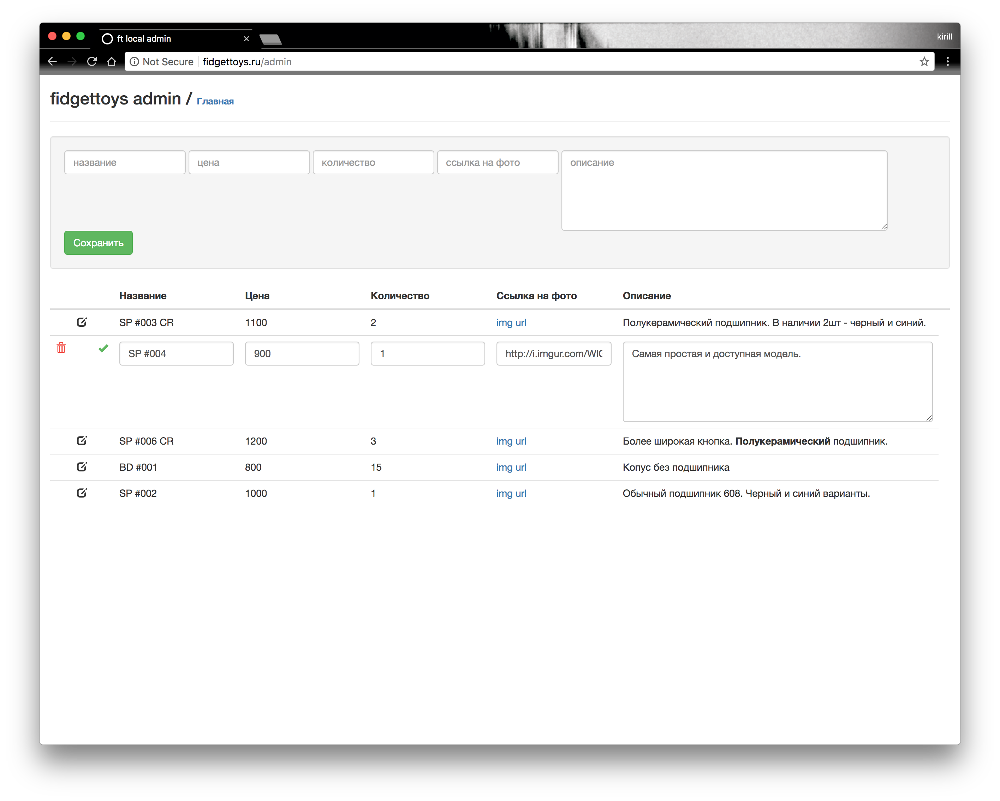

Что-то вроде небольшого статического магазина для небольших нужд с возможностью обновлять товар без необходимости делать коммиты.
Можно хостить на gh-pages.

jekyll, vue, firebase


[скриншоты](./_screens)

### fb

Создать аккаунт на firebase и добавить бд.
Добавить `Authentication` через email и password и создать нового пользователя.

### index

Обновить следующие строки в `public/js/app.js`

Яндекс кнопки: 26 - карта, 30 - кошелек

А так же ссылку на бд - строка 57.

### admin

Обновить config в `public/js/admin.js` - Строки 2-7

А так же ссылку на бд - строка 174

Так же стоит обновить все файлы в папке `_includes/`


```
jekyll serve

localhost:4000/admin // после авторизации можно добавлять товары
```

Пример item

```json
  "-KhU5PvSsRV4Vki5Ro8x": {
    "description": "Lorem ipsum dolor sit amet, consectetur adipisicing elit, sed do eiusmod.<br/>",
    "img": "http://i.imgur.com/12345.jpg",
    "price": "3500",
    "quantity": "9",
    "title": "SP #002"
  }
```


